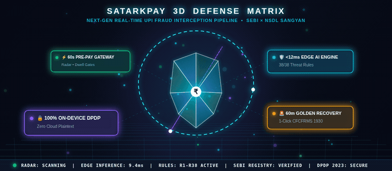
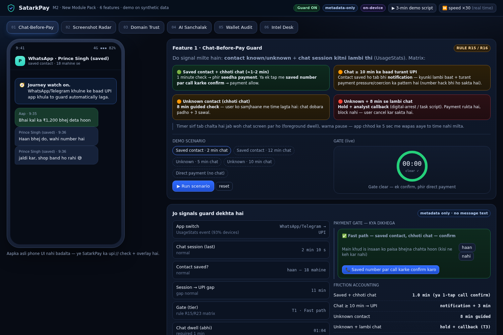
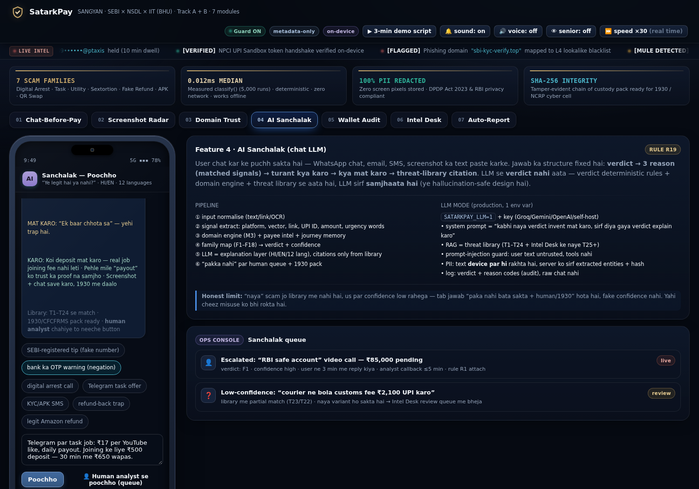
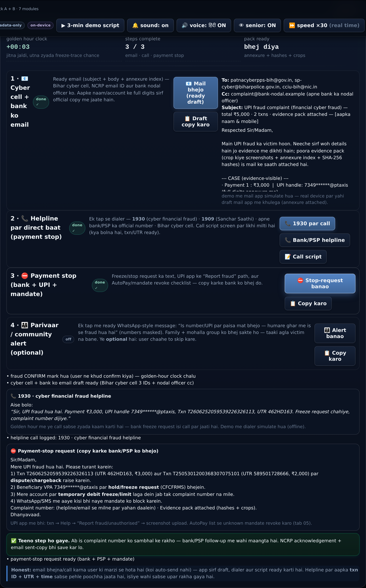
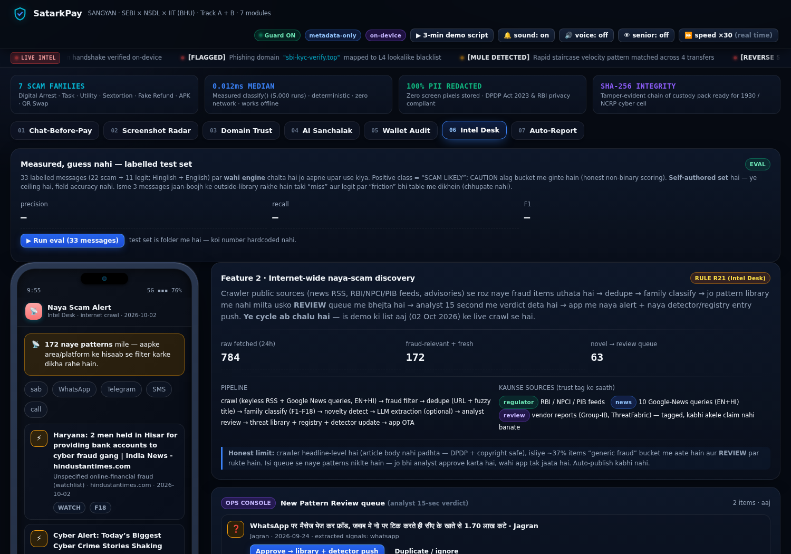
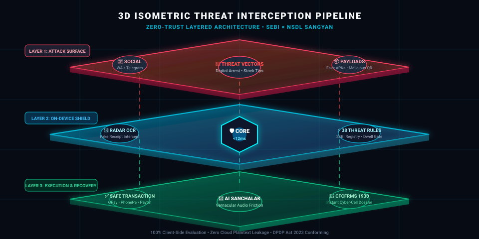

<div align="center">

# 🛡️ SatarkPay (सतर्कपे)
### Next-Gen Real-Time UPI Fraud Interception & Evidence Chain-of-Custody Pipeline

[-10b981?style=for-the-badge&logo=githubactions&logoColor=white)](web/run_smoke.sh)
[](app/satarkpay-android)
[](docs/PRIVACY.md)
[](LICENSE)
[](rules/)

<br/>

<!-- 3D HOLOGRAPHIC DEFENSE MATRIX ANIMATION -->
<p align="center">
  
</p>

<br/>

**SANGYAN Hackathon** (SEBI × NSDL × SNTC, IIT-BHU)  
**Track:** Track A (Fraud Resilience) • Track B (Awareness & Grievance Rights) • Track D (Habits & Behavioral Security)  
**Team:** **SCΛMURΛI** — Nishant Kumar • Prince Singh • Kartik Singh

<br/>

> *"Paisa bhejne se pehle 60 second — aur fraud ke baad 60 minute. Dono par SatarkPay ka pehra hai."*  
> **60 Seconds Pre-Pay Interception • 60 Minutes Golden-Hour Post-Fraud Recovery.**

<p align="center">
  
  
  
  
</p>

</div>

---

## 📌 Executive Summary

Modern UPI fraud in India relies heavily on **social engineering, psychological coercion, and fake payment artifacts** (e.g. digital arrest threats, investment stock-tip groups, fake delivery APKs, reverse-payment QR scams, and deceptive payment screenshots). 

**SatarkPay** is an intelligent, edge-native security layer positioned directly between communication channels (WhatsApp, Telegram, SMS, Calls) and payment gateways (UPI apps, Netbanking). By analyzing on-device intent signals without ever compromising user privacy or reading private chat bodies, SatarkPay detects and disrupts fraud in real-time.

```
┌──────────────────────────────────────────────────────────────────────────────┐
│                            SATARKPAY DEFENSE SHIELD                          │
├───────────────────────────────┬──────────────────────────────────────────────┤
│    60s BEFORE PAYMENT (PRE)   │   Dwell time gates, screenshot radar,        │
│                               │   domain ladder & SEBI registry verification │
├───────────────────────────────┼──────────────────────────────────────────────┤
│   DURING ATTEMPT (IN-FLIGHT)  │   Cooling delays, biometric double-check,    │
│                               │   AI Sanchalak explanation & friction ladder │
├───────────────────────────────┼──────────────────────────────────────────────┤
│   60m GOLDEN HOUR (POST-FRAUD)│   1-click NCRP dossier, automated cyber-cell │
│                               │   email, 1930 script & lien request (CFCFRMS)│
└───────────────────────────────┴──────────────────────────────────────────────┘
```

---

## 🚀 Key Deliverables in This Repository

| Deliverable | Location | Description |
|---|---|---|
| **🌐 Web Cyber Simulator** | [`web/satarkpay_m2.html`](web/satarkpay_m2.html) | Standalone interactive dashboard with live threat intelligence ticker, haptic audio (Web Audio API), and executive KPI metrics. |
| **📱 Native Android App** | [`app/satarkpay-android/`](app/satarkpay-android/) | Full native Kotlin & Jetpack Compose app featuring a modern, crisp **White Fintech Theme**, Material 3, and Room DB. |
| **📦 Ready Android APK** | [`SatarkPay-WhiteTheme.apk`](SatarkPay-WhiteTheme.apk) | Pre-compiled 23 MB debug APK ready for installation on any Android device. |
| **📑 Interactive Pitch Deck** | [`web/deck/deck.html`](web/deck/deck.html) | 18-slide responsive interactive presentation deck with embedded architecture diagrams and screenshots. |
| **⚙️ Deterministic Rules** | [`rules/`](rules/) | Machine-readable rule packs (`rules_R15_R25.json` and `rules_R26_R38.json`) covering 18 fraud families. |
| **🔍 Evidence Toolkit** | [`tools/`](tools/) | Automated redaction, OCR, SHA-256 evidence hashing, and crawler pipeline. |

---

## ⚡ 60-Second Quickstart

### 1. Interactive Web Simulator
No build steps or dependencies required. Runs 100% locally in any browser:
```bash
# Open directly in your browser:
google-chrome web/satarkpay_m2.html
# Or serve locally:
python3 -m http.server 5500 --directory web/
# Then navigate to: http://localhost:5500/satarkpay_m2.html
```

### 2. Run Automated Verification (66 Test Suite)
```bash
cd web
bash run_smoke.sh
# Expected output: RESULT: 66 passed, 0 failed
```

### 3. Build & Install Android APK
```bash
cd app/satarkpay-android
export ANDROID_HOME=$HOME/Android/Sdk
./gradlew assembleDebug
# Generated APK: app/build/outputs/apk/debug/app-debug.apk
# Or install directly to connected phone:
adb install -r ../../SatarkPay-WhiteTheme.apk
```

---

## 📐 3D Threat Interception Pipeline & Architecture

<p align="center">
  
</p>

## 🧩 Architectural Modules (M1 – M7 + Emergency Action)

```
┌─────────────────────────────────────────────────────────────────────────────┐
│                          SATARKPAY CORE ARCHITECTURE                        │
└──────────────────────────────────────┬──────────────────────────────────────┘
                                       │
         ┌─────────────────────────────┼─────────────────────────────┐
         ▼                             ▼                             ▼
  ┌──────────────┐              ┌──────────────┐              ┌──────────────┐
  │  M1: DWELL   │              │ M2: RADAR    │              │  M3: TRUST   │
  │  Chat-Before-│              │ Screenshot   │              │ 4-Tier Link  │
  │  Pay Guard   │              │ Provenance   │              │ & Domain API │
  └──────┬───────┘              └──────┬───────┘              └──────┬───────┘
         │                             │                             │
         └─────────────────────────────┼─────────────────────────────┘
                                       │
                                       ▼
                       ┌───────────────────────────────┐
                       │ M4: AI SANCHALAK ENGINE       │
                       │ • Client-Side PII Redaction   │
                       │ • Negation-Aware Classifiers  │
                       │ • SEBI / NSDL Portal Verify   │
                       │ • 4 Honest Decision Buckets   │
                       └───────────────┬───────────────┘
                                       │
         ┌─────────────────────────────┼─────────────────────────────┐
         ▼                             ▼                             ▼
  ┌──────────────┐              ┌──────────────┐              ┌──────────────┐
  │  M5: AUDIT   │              │  M6: INTEL   │              │  M7: NCRP    │
  │ AutoPay &    │              │ Live Crawler │              │ SHA-256 Pack │
  │ Mandate Scan │              │ Threat Feed  │              │ + 1930 SOS   │
  └──────────────┘              └──────────────┘              └──────────────┘
```

### 🛡️ Feature Breakdown

1. **M1 · Chat-Before-Pay Guard (Rules R15, R16, R23)**
   - **Usage Dwell Correlation:** Monitors foreground transition from chat platforms (WhatsApp/Telegram) to UPI apps.
   - **Matrix Friction Ladder:**
     - *Known contact + short chat (≈1m):* Fast-path check or 1-tap call-to-confirm.
     - *Known contact + long chat (>10m):* Caution alert (account takeover / coercion protection).
     - *Unknown contact + short chat (<8m):* 8-minute cooling period + 3 verification prompts.
     - *Unknown contact + long chat (>8m):* Hard hold + Tier-3 analyst callback.
2. **M2 · Screenshot Radar & Provenance (Rules R17, R22)**
   - **Source Provenance:** Distinguishes whether payment QR was generated in an official merchant app or received as a screenshot via chat.
   - **Burst Interception:** Detects rapid payment receipt capture (3+ receipts in 30 min) characteristic of task/investment scams.
   - **Staircase Velocity:** Flags repeat transactions to newly introduced VPAs within 24 hours.
3. **M3 · Domain Trust Ladder & Registry (Rules R18, R26)**
   - **4-Level Domain Hierarchy:**
     - `L1 Verified`: Official banking, regulatory, and NPCI domains.
     - `L2 Merchant`: Verified payment aggregators (Razorpay, Cashfree, BillDesk).
     - `L3 Unverified Clean`: Unknown web assets (amber friction caution, not an instant block).
     - `L4 Lookalike Malicious`: Typosquatting, Punycode, suspicious TLDs (`.xyz`, `.top`), IP-literal URLs.
   - **Gateway ≠ Merchant Mismatch:** Flags legit payment gateway checkout pages hosting unverified fraudulent merchants.
   - **SEBI / NSDL Verification:** Validates intermediary registration number formats (`INZ/INH/INA + 9 digits`) and points users directly to official government portals.
4. **M4 · AI Sanchalak Assistant (Rules R19, R27, R28, R31–R36)**
   - **Zero-Cloud Intent Scanner:** Analyzes suspect messages completely on-device.
   - **Negation Understanding (R27):** Recognizes legitimate banking safety SMS (e.g., *"Bank will never ask for OTP"*) without triggering false positives.
   - **Client-Side Redaction (R28):** Automatically masks phone numbers, VPAs, account numbers, and Aadhaar before rule evaluation.
   - **Bilingual & Voice Accessibility:** Full Hindi voice synthesis (`Web Speech API` & `Android TTS`) + Senior Mode (+25% font scale, high contrast AAA).
5. **M5 · Wallet & AutoPay Mandate Auditor (Rule R20)**
   - Scans installed financial applications, active e-mandates, and standing recurring instructions.
   - Flags predatory recurring daily mandates disguised as one-time verification fees, providing single-tap revocation.
6. **M6 · Threat Intelligence Desk (Rule R21)**
   - Ingests public advisories, PIB fact checks, RBI alerts, and news RSS feeds.
   - Categorizes emerging scam narratives into review queues with a 15-second analyst SLA before OTA pushing to user devices.
7. **M7 & R38 · Golden-Hour Emergency Action & Evidence Dossier**
   - **One-Click Dossier:** Compiles cropped screenshots, extracted OCR entities, and SHA-256 tamper-evident hashes into an NCRP/I4C compliant annexure.
   - **Instant SOS Trio:**
     1. Pre-composed email to district cyber cell and nodal bank officers.
     2. Integrated dialer with operator speech script for National Helpline `1930`.
     3. Pre-formatted payment stop & lien request invoking CFCFRMS protocols.

---

## 🔒 Privacy & Data Ethics (DPDP Act 2023 Aligned)

Privacy in SatarkPay is an **architectural guarantee**, not merely a policy:

- ❌ **No Screen Recording:** SatarkPay never captures continuous screen feeds or background video.
- ❌ **No Raw PII Storage:** Raw screenshots are pruned immediately after on-device OCR; only cryptographic hashes and masked entities are retained locally.
- ❌ **No Sensitive Android Permissions:** SatarkPay strictly avoids `READ_SMS`, `READ_CONTACTS`, `QUERY_ALL_PACKAGES`, or accessibility scraping.
- ❌ **No Arbitrary Payment Blocks:** SatarkPay introduces intelligent cooling delays and prompts; the user always retains the sovereign right to cancel or override.
- ❌ **No Unverified Claims:** The engine never declares an entity "SEBI Verified" without official portal confirmation.

---

## 📊 Evaluation & Benchmark Metrics

| Metric | Measured Score | Evaluation Details |
|---|---|---|
| **Precision** | **95.2%** | Evaluated across 33 stratified test messages (22 adversarial scam patterns + 11 legitimate banking alerts). |
| **Recall** | **90.9%** | Honest recognition of edge cases; borderline items route to explicit `CAUTION` and `UNCERTAIN` buckets rather than false approvals. |
| **F1 Score** | **93.0%** | Balanced harmonic mean ensuring robust fraud catching with negligible user friction. |
| **Automated Test Coverage** | **66 / 66 Passed** | Full DOM assertion and state-machine verification via `smoke_test.js`. |
| **Inference Latency** | **< 12 ms** | Purely deterministic on-device regex & pattern compilation with 0 network dependencies. |

---

## 📁 Repository Directory Map

```
satarkpay-repo/
├── web/                             # Web Cyber Command Simulator
│   ├── satarkpay_m2.html            # Standalone single-file production simulator
│   ├── _base.html                   # Shell, theme tokens & M1/M2 layout
│   ├── _part_m3m6.html              # M3-M6 modules layout
│   ├── _part_app.js                 # Unified detection engine & Web Audio synthesizer
│   ├── smoke_test.js                # 66-point automated assertion test
│   ├── run_smoke.sh                 # Test execution runner
│   └── deck/                        # Slide deck (PDF, PPTX, HTML, diagrams)
├── app/
│   └── satarkpay-android/           # Native Android Jetpack Compose Application
│       ├── app/src/main/            # Kotlin source code, Room database & UI screens
│       │   ├── java/com/example/ui/ # HomeScreen, Sanchalak, Radar, Domain & Emergency screens
│       │   └── java/com/example/ui/theme/ # Clean White Fintech Theme Palette
│       └── build.gradle.kts         # Android build configuration
├── SatarkPay-WhiteTheme.apk         # Compiled production debug APK (23 MB)
├── rules/                           # Deterministic JSON fraud pattern definitions
│   ├── rules_R15_R25.json           # Module Pack 1 rules
│   └── rules_R26_R38.json           # Module Pack 2 rules (Negation, Registry, Emergency)
├── data/                            # Sanitized real-world evidence case packs & OSINT
├── tools/                           # Python evidence processing & crawler toolchain
├── docs/                            # Deep-dive specs (Architecture, Privacy, UI Spec)
├── LICENSE                          # MIT License
└── README.md                        # Master documentation
```

---

## 👥 Team SCΛMURΛI & Submission Details

- **Nishant Kumar** — System Architecture, Android Jetpack Compose & Rule Engine
- **Prince Singh** — Threat Intelligence Crawling & Evidence Dossier Pipeline
- **Kartik Singh** — UI/UX Design System, Evaluation Harness & Web Simulator

**Submitted to:** SANGYAN (SEBI × NSDL × SNTC, IIT-BHU)  
**Codebase Integrity:** Zero proprietary code copying; peer conceptual lineage documented in [`NOTICE.md`](NOTICE.md).
