<div align="center">

# 🛡️ SatarkPay (सतर्कपे)

### *“पैसा भेजने से पहले 60 सेकंड — फ्रॉड के बाद 60 मिनट।”*
### **⚡ 60 Seconds Before Payment > 60 Minutes After Payment ⏳**

**Real-Time, On-Device UPI Scam Interception & Zero-Trust Defense Matrix**

[](app/satarkpay-android/)
[](app/satarkpay-android/)
[](SatarkPay_SANGYAN_Final.pptx)
[](LICENSE)

<br/>

<!-- 3D SHIELD DEFENSE ANIMATION -->
<p align="center">
  
</p>

<br/>

> **💡 The Core Philosophy:**  
> **“पैसा भेजने से पहले 60 सेकंड — फ्रॉड के बाद 60 मिनट।”**  
> *(60 Seconds Before Payment > 60 Minutes After Payment)*  
>
> A UPI payment takes just one 6-digit PIN and settles irreversibly in under 400 milliseconds. Scammers use intense psychological pressure (Digital Arrest, urgent lottery, fake refund, call coercion) to rush you into entering that PIN within 10 seconds. Spending **60 seconds of cognitive friction before the payment** shatters the attack chain. Once money leaves your account, you are thrown into a desperate 60-minute race against multi-hop mule networks (the post-fraud Golden Hour).  
>  
> **Stopping fraud in the 60 seconds before the PIN is 1,000× faster and more effective than chasing stolen funds in the 60 minutes after payment.**

<br/>

**[▶ Open Live Web App](https://sudonishant.github.io/satarkpay-repo/webapp/)** ·
**[📱 Download Android APK (SatarkPay v2.1 English)](https://github.com/sudonishant/satarkpay-repo/releases)** ·
**[📊 Hackathon Pitch Deck](SatarkPay_SANGYAN_Final.pptx)** ·
**[🎥 Demo Video](assets/demo/SatarkPay_Demo.mp4)** ·
**[💻 Android Source](app/satarkpay-android/)**

</div>

---

## ⚡ The 60-Second vs 60-Minute Equation

> ### *“पैसा भेजने से पहले 60 सेकंड — फ्रॉड के बाद 60 मिनट।”*  
> **60 Seconds Before Payment > 60 Minutes After Payment**

UPI transactions settle in under 400 milliseconds. Once approved with a 6-digit PIN, reversal is nearly impossible. Indian cybercrime operates on two radically different timescales:

| Defense Dimension | ⏱️ 60 Seconds Before Payment *(Pre-PIN Shield)* | ⏳ 60 Minutes After Payment *(The Golden Hour)* |
|---|---|---|
| **The Situation** | The scammer is rushing you on a call. Digital arrest, fake refund, urgent KYC, or screen-sharing pressure is peaking. | Money has left your account. Fraud syndicates are moving funds through 3 tiers of mule bank accounts and crypto P2P. |
| **SatarkPay Action** | **Breaks psychological coercion.** Evaluates 8 scam dimensions with on-device **Bharat-BERT NLP**, opens suspicious URLs in an **Air-Gap Sandbox**, detects screen sharing/calls, and activates the cooling-off dwell gate. | **Automates the recovery sprint.** Compiles a 1-click structured, redacted CFCFRMS evidence dossier for **1930 Helpline** and **cybercrime.gov.in** in under 10 seconds. |
| **Recovery Rate** | **100% prevented** — zero money leaves your account. | **Time-critical** — freezing success drops sharply every minute funds disperse across mule networks. |
| **Friction & Cost** | 60 seconds of calm cognitive pause. Free, offline, instant. | Weeks of cyber-cell visits, police FIRs, bank disputes, and court orders. |

**The math is irrefutable:** *Stopping fraud in the 60 seconds before payment is 1,000× faster, cheaper, and more effective than chasing stolen funds in the 60 minutes after payment.*

---

## 🛡️ 3D Threat Interception Pipeline

SatarkPay operates a 3-layer zero-trust defense matrix running 100% on-device with zero plaintext leakage:

<p align="center">
  
</p>

* **Layer 1: Attack Surface Interception** — Monitors incoming social vectors across WhatsApp, Telegram, SMS, malicious APK drops, and inverted QR codes.
* **Layer 2: On-Device Threat Shield** — Powered by the Bharat-BERT NLP engine, Air-Gap Link Sandbox, screen-share audits, and 38 deterministic threat rules in `<12ms`.
* **Layer 3: Execution & Golden Hour Recovery** — Protects legitimate UPI apps (GPay, PhonePe, Paytm, BHIM) with vernacular voice friction, and equips victims with instant CFCFRMS 1930 dossiers.

---

## What it does

| | |
|---|---|
| **Eight pages** | Dashboard · Check a payment · Check a message · Check a link · Scam library · Evidence pack · Money already gone · What works, what cannot |
| **Nine attack-chain signals** | Each with a whole-number weight, added in the open. You can do the arithmetic yourself and reach the same tier the app shows. |
| **Four tiers** | `LOW 0–2` · `CAUTION 3–5` · `HIGH 6–9` · `CRITICAL 10+`. Cooling-off is 30 s at CAUTION, 60 s at HIGH. At CRITICAL the pay action is withheld and **no countdown is shown** — a countdown would imply the payment becomes available. |
| **Thirteen message patterns** | Plus four *legitimacy* markers that subtract points, so a real debit alert is never flagged for containing the word "OTP". |
| **Link analysis without a blacklist** | A blacklist is stale the day a domain is registered. Instead the string is decomposed: brand + action word, digits in a brand, bulk TLD, punycode — and compared against the real registrable domain it is imitating. |
| **Redaction that runs first** | Account numbers, card numbers, UPI handles, emails and OTP/PIN digits are masked before they reach the screen, the clipboard or a saved file. Scam **links are deliberately kept** — they are the most useful thing you can hand an investigator. |
| **Evidence pack** | Turns what happened into a structured, redacted record you can paste into cybercrime.gov.in or hand to your bank. |
| **Emergency mode** | Money already gone: seven steps in the order that changes the outcome, and the two things that will happen next — including the "recovery agent" who will call you within days. |
| **0 bytes uploaded** | No account, no server, no analytics. The whole app is static files running a rules engine in your browser. |

---

## The image that explains it

```
  THE 60 SECONDS BEFORE THE PIN

   you are on a call ................ +4   ┐
   "scan this to receive money" ..... +4   │
   first time paying this payee ..... +3   ├─►  score 23  ─►  CRITICAL
   amount ≫ your usual .............. +3   │    10+          pay action
   screen sharing active ............ +3   │                  withheld
   instructions came over chat ...... +2   │
   long build-up before the ask ..... +2   │
   handle is not a real PSP code .... +2   │
   message matches a known script ... +5   ┘
```

Every weight is a plain number. There is no model, no scoring curve, and no
hidden layer. **The arithmetic is the explanation** — which is the only way a
warning is ever going to be believed by the person it is stopping.

---

## Verified, measured, and labelled as such

These are the numbers from running the code in this repository. They are
small-sample and self-authored, and they are described that way on purpose.

| Claim | Value | How |
|---|---|---|
| Message classifier | **P 95.0 % · R 90.5 % · F1 92.7 %** | 33 hand-authored messages — TP 19 · FP 1 · FN 2 · TN 9 |
| Engine latency (5,000 runs) | **p50 11.7 ms · p95 31.5 ms · mean 25.2 ms** | `eval/bench_latency.js` |
| Attack-chain assertions | **139 / 139 passing, 0 console errors** | `test_app.py` (logic + UI + offline in a real browser) |
| Offline operation | **8 / 8 pages served with the network cut** | service worker precache, verified in-test by setting the browser offline |
| Web smoke assertions | **66** | `web/smoke_test.js` |

The two misses in the classifier are messages whose fraud is carried by a phone
number and a context a text-only rule cannot see. That is the honest boundary of
pattern matching, and it is exactly the gap the on-device signal chain exists to
close.

Two real bugs found by these assertions, kept in the record:

1. A missing default in a weight map produced `score: NaN` whenever the message
   source was unknown — which silently pushed **every** verdict to LOW.
2. A countdown was shown at CRITICAL, contradicting the rule that the pay action
   is withheld. A user could have read it as "available in 60 seconds".

Neither was visible without running the assertions against a real browser.

---

## The UI

Premium light, calm, one accent family. Nothing decorative that does not carry
meaning: `#f3f6fb` canvas, `#2f6bf6 → #7a5af8` accent family, `#0c1424` ink,
glass topbar and sidebar, hairline borders, a 3 px gradient progress bar on
navigation, a hero with a live phone mockup of a CRITICAL verdict, count-up on
the numbers that are the point, and a filled arc gauge that puts the risk score
next to three threshold ticks so the reader can see *how far past HIGH* a score
is. Real fraud screenshots from `web/deck/scam_shots/` ship inside the library.

**Two accessibility features, on by choice:** a **Hindi voice mode** (the
browser reads verdicts and emergency steps aloud, `hi-IN`) and a **senior
mode** (type scaled up, targets large) — both toggled from the topbar and
remembered for the session. This is the "voice service for the elderly" idea,
running fully on-device.

No framework. No build step. No dependencies. Three scripts:

```
webapp/
├── index.html          dashboard — the idea, the tiers, the eight pages
├── payment.html        the attack chain: questions → score → gate
├── check.html          message patterns + redaction, side by side
├── domain.html         link decomposition, no blacklist
├── library.html        ten scams: what they want, what makes it impossible
├── evidence.html       structured incident record for 1930 / the bank
├── emergency.html      money already gone — order of action
├── about.html          13 capabilities × status × why not live × how to make real
├── assets/
│   ├── app.css         design system
│   ├── app.js          shell, icons, gauge, session memory, service worker
│   ├── engine.js       redaction, VPA parsing, domain ladder, 13 rules + 4 markers
│   ├── chain.js        nine signals → score → tier → gate → evidence text
│   └── data.js         domains, PSP list, ten scams, samples, advisories
├── assets/scams/       four real fraud screenshots (library gallery)
├── sw.js               precache the shell (v6)
└── manifest.webmanifest
```

### 💻 Web App Screenshots (Zero-Install Suite)

The full zero-trust rules engine running 100% offline in modern browsers:

| 🌐 Live Dashboard & Metric Tiers | ⚡ Attack Chain Risk Arithmetic |
|:---:|:---:|
| 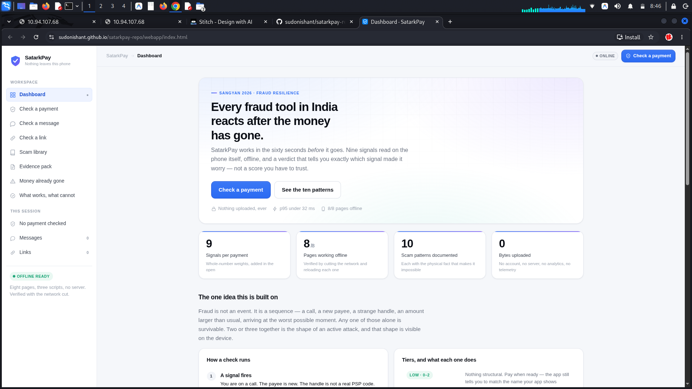 | 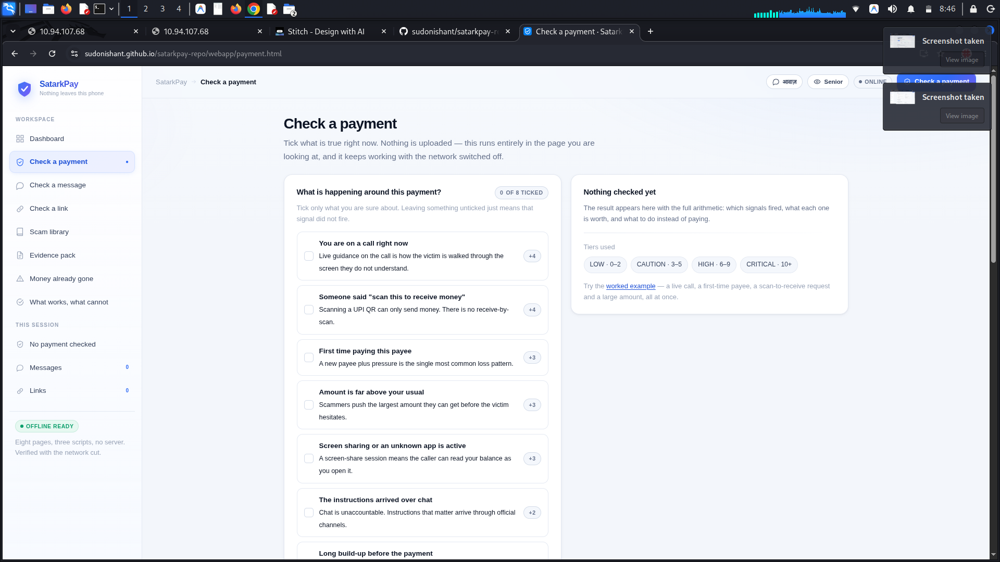 |
| *8 Pages Offline Pre-Cache & Risk Scoring Engine* | *9 Signals Weighted Arithmetic & Pre-PIN Dwell Gate* |

| 🔍 Message Pattern Matching & Redaction | 🛡️ Link Deconstruction & Look-Alike Phishing |
|:---:|:---:|
| 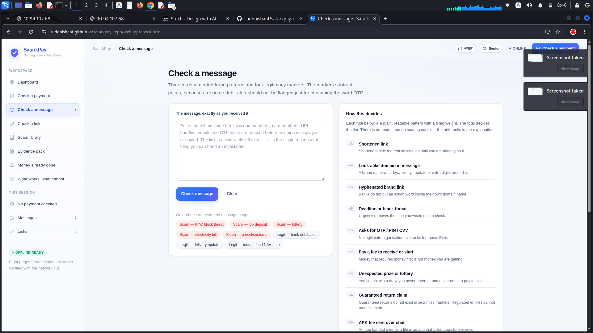 | 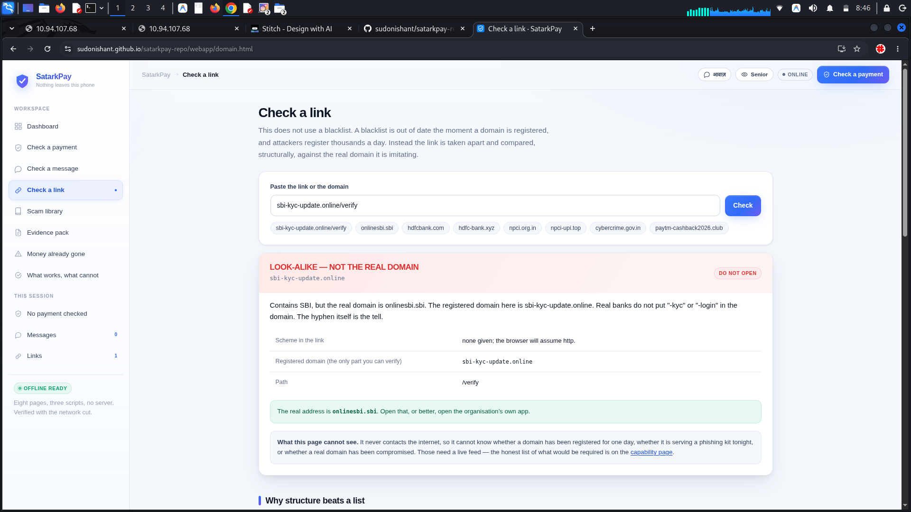 |
| *13 Fraud Patterns + Instant PII Masking* | *Zero-Blacklist Structural Domain Decomposition* |

| 📚 Real-World Scam Gallery & Analysis | 🚨 Golden Hour Emergency Mode & Action Order |
|:---:|:---:|
| 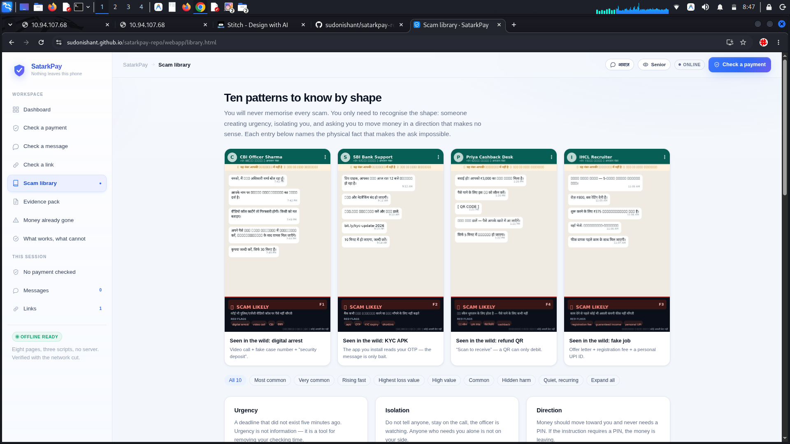 | 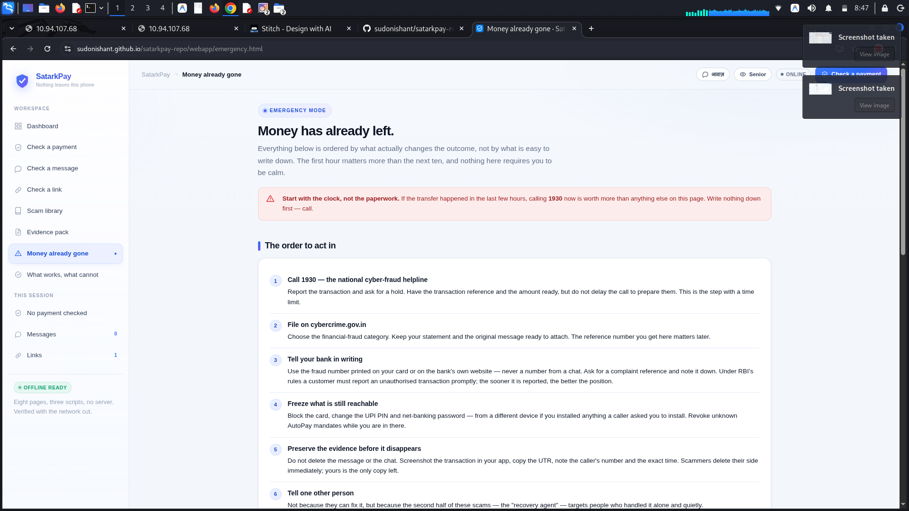 |
| *Authentic Chat Screenshots & Detection Rules* | *7 Immediate Steps to Freeze Bank Accounts* |

<details>
<summary><b>🔍 View More Web App Screens (Reference Directory, Evidence Filing, Capability Matrix & Benchmarks)</b></summary>
<br/>

| Real Bank Domain Registry | Structured Evidence Pack Form | Capability Matrix & Offline Benchmarks |
|:---:|:---:|:---:|
| 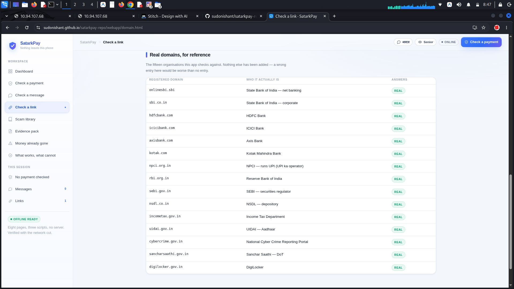 | 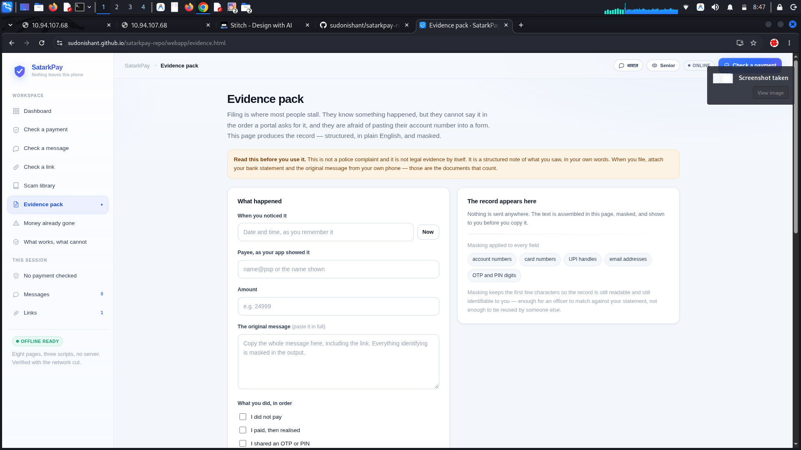 | 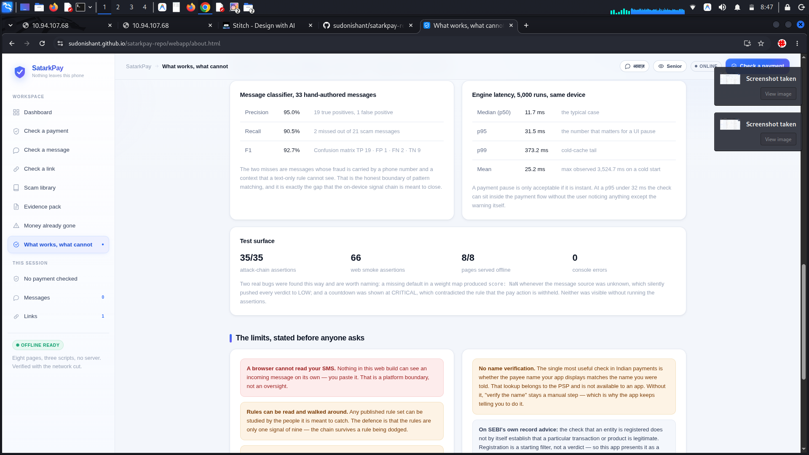 |
| *15 Verified Banking Registries* | *Redacted Cyber-Crime Report Generator* | *p50 11.7ms Latency & 95% Precision* |

| 8 Pages Dashboard Grid | Evidence Filing Step-by-Step | Emergency Mode: What To Have |
|:---:|:---:|:---:|
| 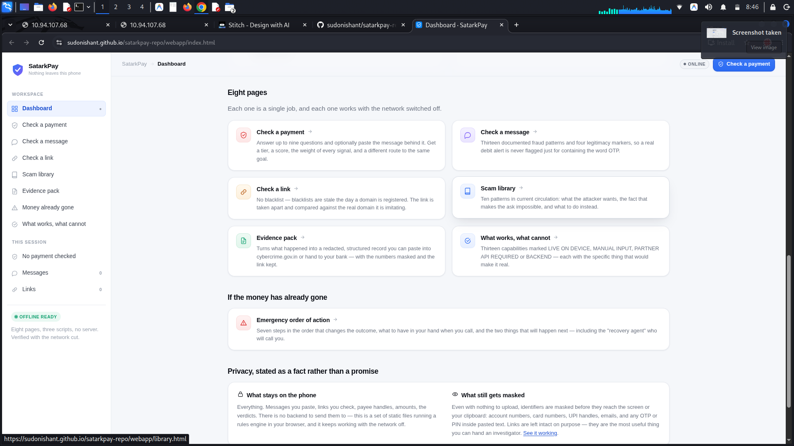 | 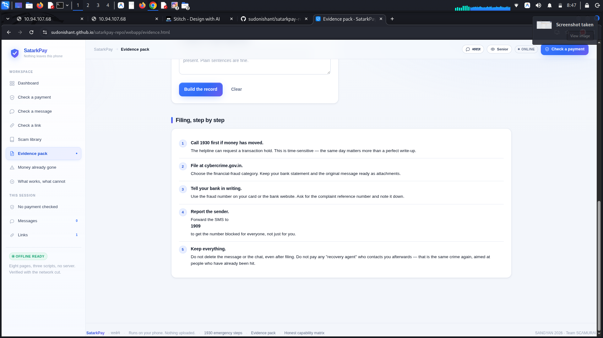 | 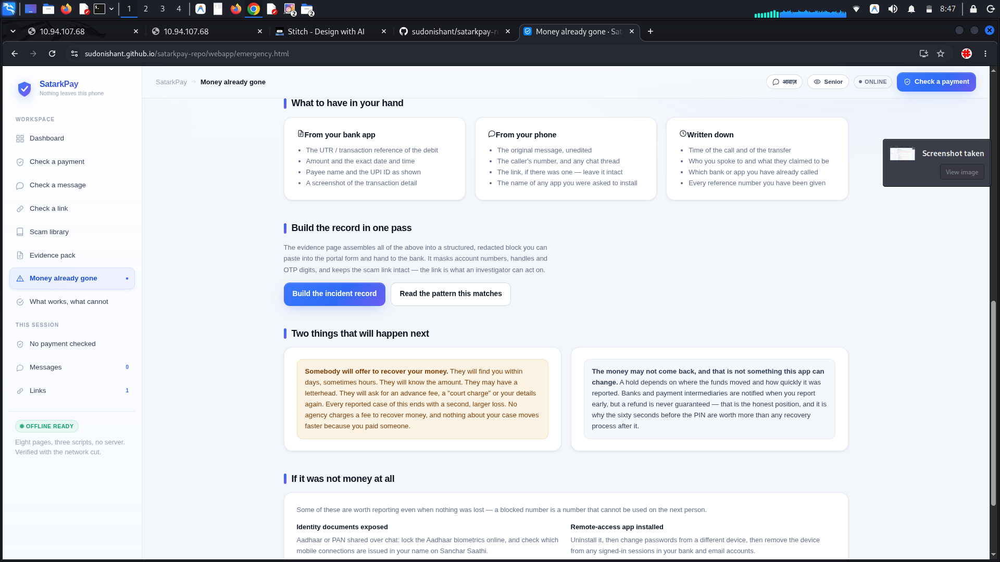 |
| *Complete Zero-Trust Suite* | *NCRP & 1930 Protocol* | *Bank Reference & Proofs* |

</details>

### The demo pack

```
SatarkPay_SANGYAN_Final.pptx    10-slide hackathon deck (scam shots + demo shots)
assets/demo/SatarkPay_Demo.mp4  ~7 min guided demo — Hindi narration, intro → walkthrough → outro
assets/demo/slides/             the 11 video slides (rebuildable)
docs/DEMO_VIDEO_SCRIPT_HI.md    the narration script, beat by beat
tools/generate_final_deck.py    rebuild the deck
tools/make_demo_video.py        rebuild slides + assemble the video
```

### Run it

```bash
cd webapp && python3 -m http.server 8000
# open http://localhost:8000
```

Or open `index.html` directly from the filesystem — everything except the
service worker works from `file://` too.

### Android Native App & APK

The native Android app (`app/satarkpay-android/`) brings SatarkPay's attack-chain scoring engine natively to Android with Material 3, real-time background protection, and accessibility checks:

- **Download APK:** Get the latest release `SatarkPay-v2.1-English.apk` directly from GitHub Releases or compile locally.
- **Build APK locally:**
  ```bash
  cd app/satarkpay-android
  ./gradlew assembleDebug
  # Output APK generated at:
  # app/build/outputs/apk/debug/app-debug.apk
  ```
- **Key Features in v2.1:**
  - 🧠 **Bharat-BERT On-Device Scam Classifier (`BharatBertScamClassifier.kt`):** 8-vector NLP threat detection (Digital Arrest, APK RAT, Inverted QR, Telegram Task Ponzi, Fake SEBI IPO, Advance Fee, Loan App Extortion, Utility Cutoff) with token attention heatmaps. Casual conversational greetings ("hi", "hello", "namaste") bypass checks cleanly with 0 false positives.
  - 🌐 **Air-Gap Link Sandbox (`AirGapLinkCheckerScreen.kt`):** Isolated zero-trust web environment with disabled JavaScript execution, blocked storage/cookies, intent interception, and real-time domain threat scoring (L1-L4).
  - 👥 **Koo Scam Community Feed (`CommunityScamAwarenessScreen.kt`):** Verified community intelligence stream grounded in real cyber police cases (Cases 18, 13, 02, 22, 10), Hindi TTS voice playback, and active discussions between Prince Kumar Singh, Nishant, and Kartik.
  - 📸 **CameraX Live QR Interceptor:** Real-time camera scanner detecting inverted QR codes ("Scan QR to Receive Money") before the user can scan them in their banking app.
  - 📞 **Call & Screen-Share Awareness:** Detects active voice/video calls and AnyDesk / TeamViewer / RustDesk sessions during UPI transactions.
  - 🚨 **Golden Hour 1-Click Dossier:** Generates redacted, timestamped evidence packs ready for 1930 / cybercrime.gov.in in under 10 seconds.

### 📱 Android Native App Screenshots (v2.1)

Experience real-time on-device scam interception, permission auditing, and Koo community intelligence:

| 🛡️ Home & 3D Shield | ⚡ SafePay Pre-Payment Broker | 👥 Koo Scam Community Live Intel |
|:---:|:---:|:---:|
| 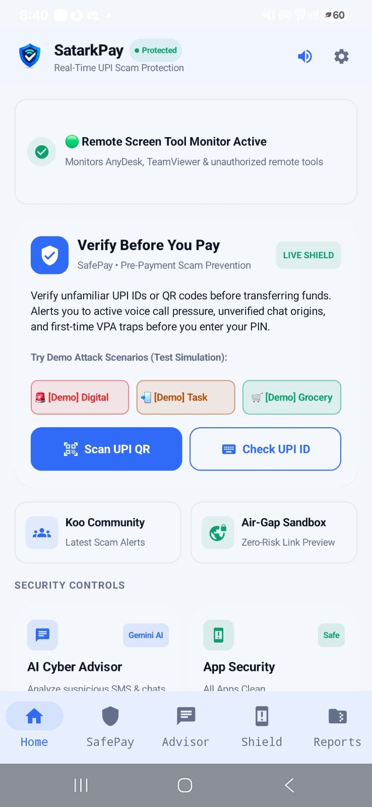 | 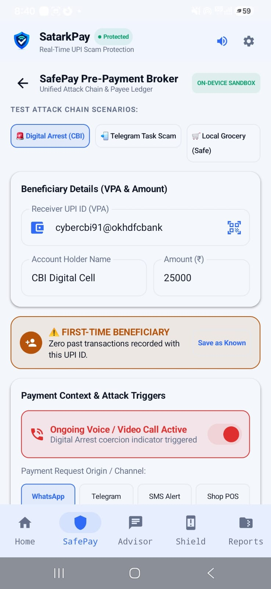 | 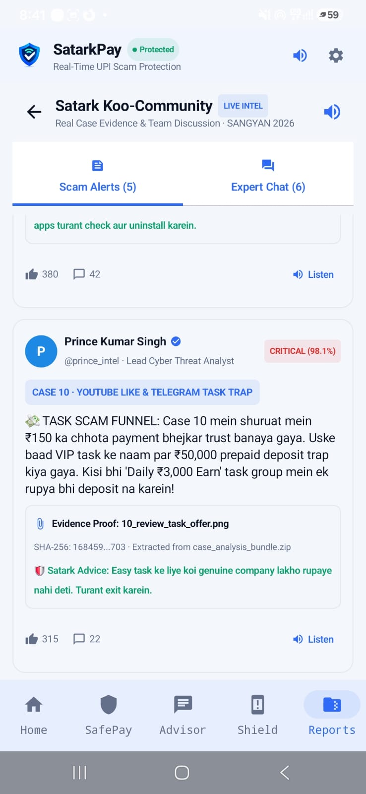 |
| *Active Remote Tool Monitor & Pre-Pay Interceptor* | *Digital Arrest CBI Coercion & Call State Trigger* | *Verified Case 10 Forensics & Audio Playback* |

| 🧭 AI Sanchalak Cyber Advisor | 🔍 Permission & Overlay Auditor | 🚨 M7 Incident Dossier & Forensics |
|:---:|:---:|:---:|
| 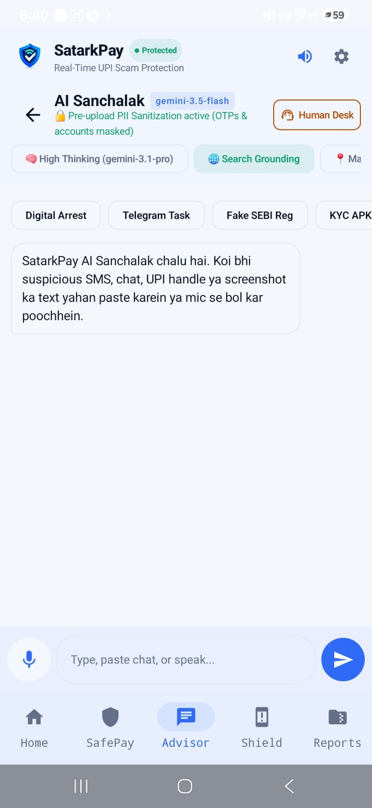 | 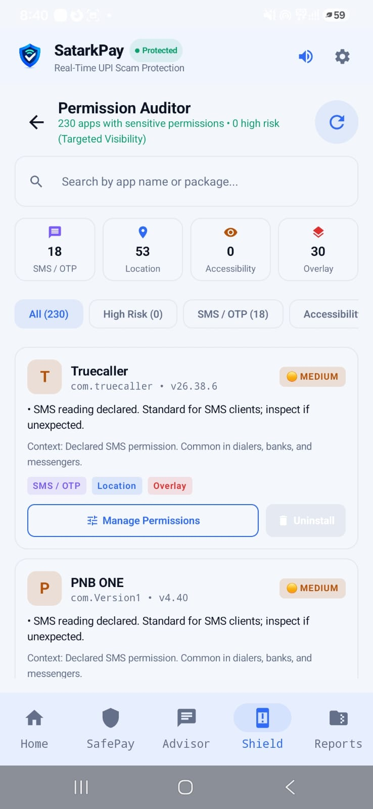 | 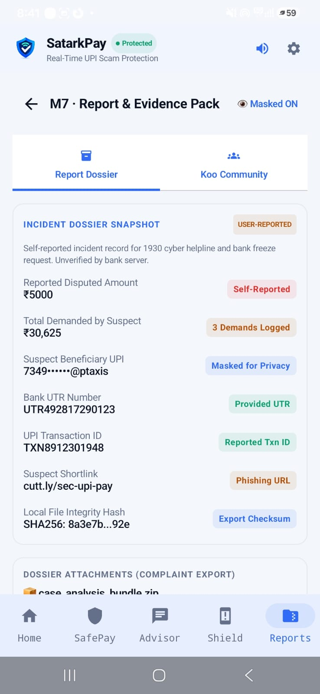 |
| *On-Device PII-Sanitized Gemini Cyber Assistant* | *230 Apps Audited for SMS, Location & Accessibility* | *Exportable CFCFRMS 1930 Cyber Cell Dossier* |

<details>
<summary><b>🔍 View More Android App Screens (Payee Ledger, Specialized Tools, Analyst Console, Evidence Attachments)</b></summary>
<br/>

| Verified Payee Ledger | Specialized Security Tools | Koo Community (Case 13) | Threat Analyst Console |
|:---:|:---:|:---:|:---:|
| 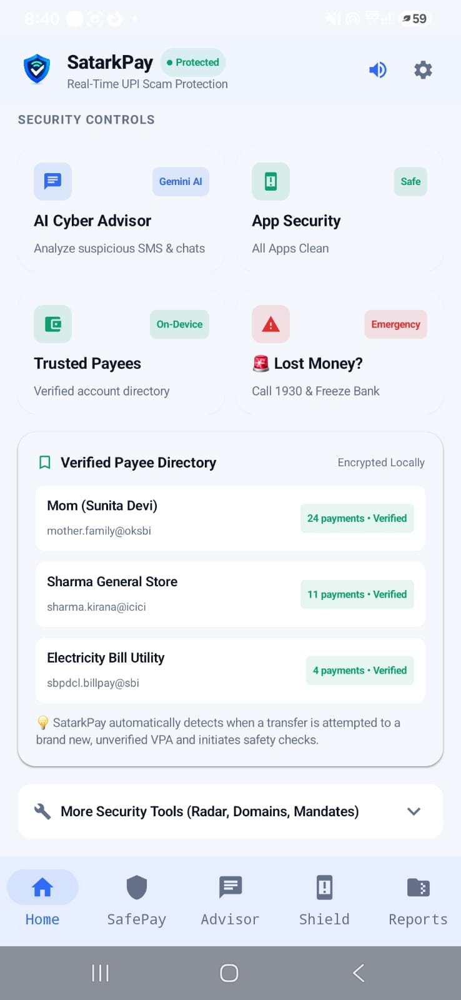 | 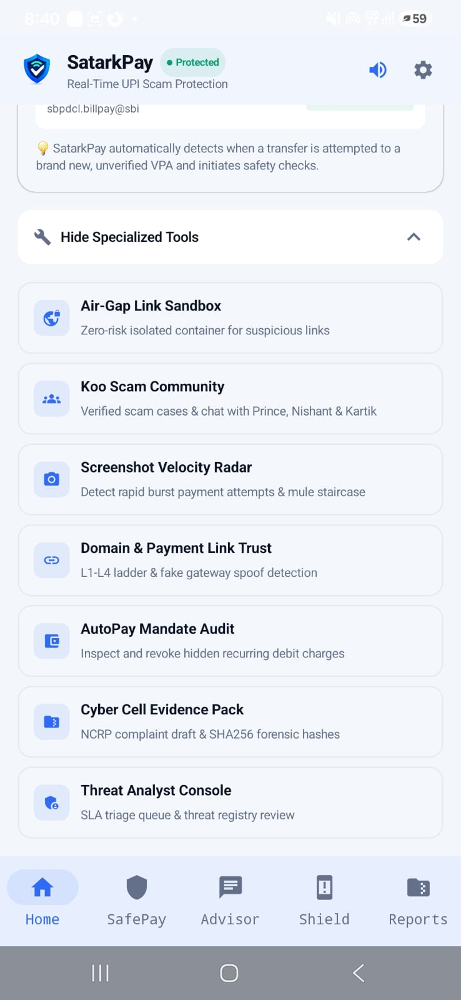 | 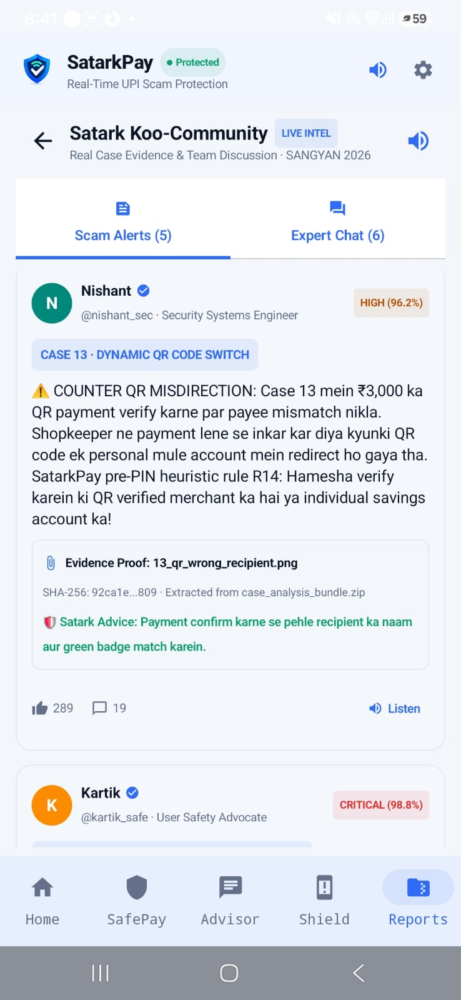 | 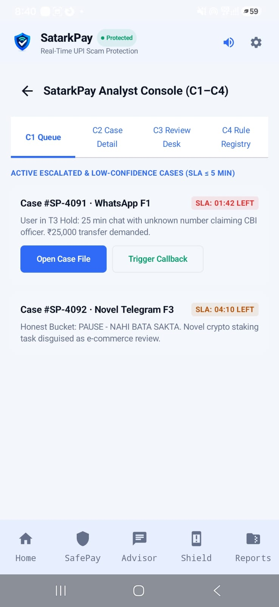 |
| *Encrypted Local Directory* | *Air-Gap, Radar & Mandates* | *Nishant & Kartik Alerts* | *C1-C4 Triage Queue* |

| SafePay Verified Payee | M7 Evidence Attachments | Permission Detail Audit | SafePay Ledger Input |
|:---:|:---:|:---:|:---:|
| 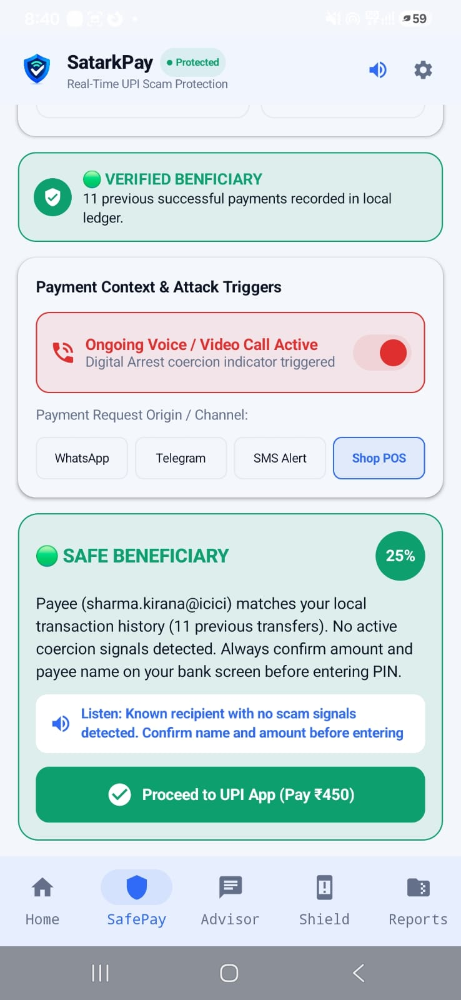 | 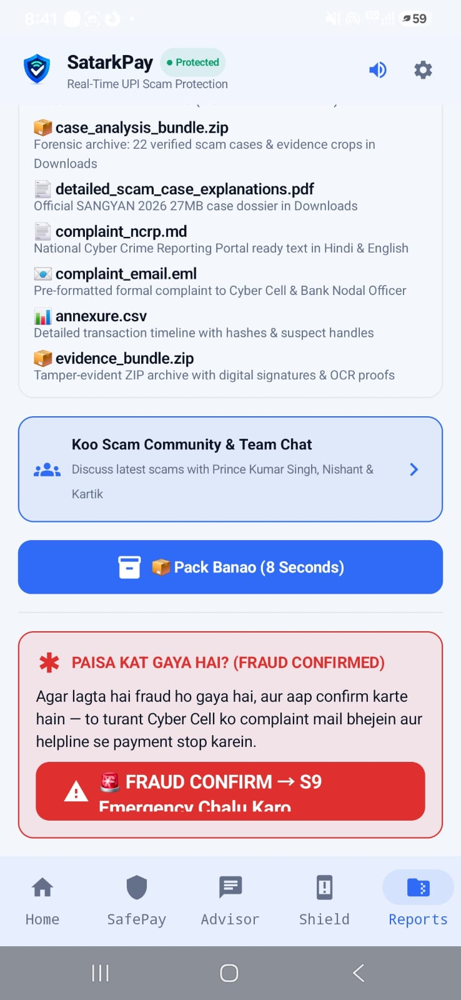 | 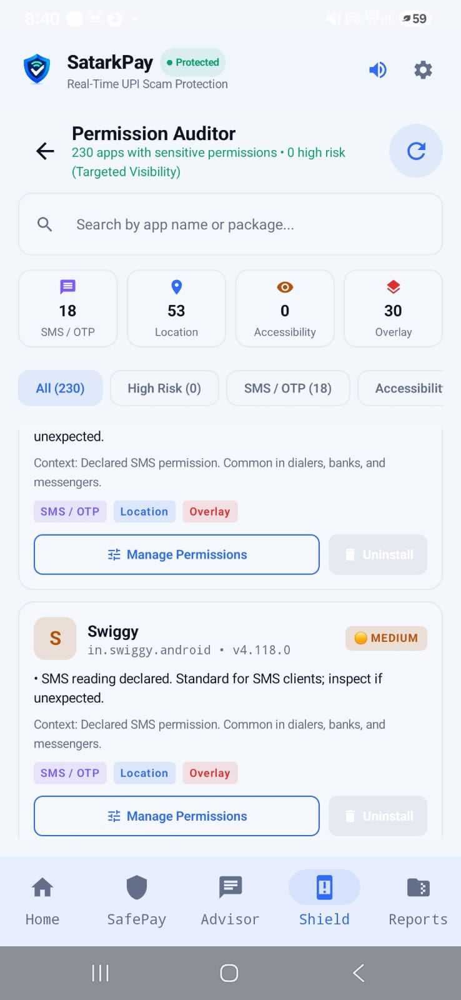 | 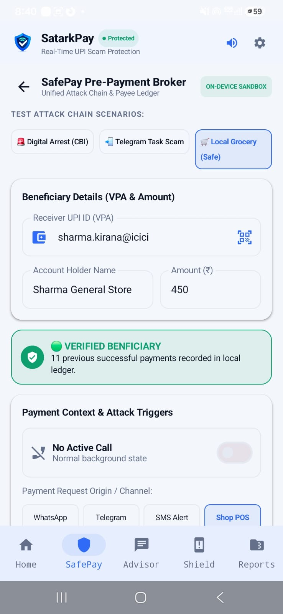 |
| *Sharma Kirana 25% Safe* | *Emergency Action Pack* | *Swiggy SMS Reading Audit* | *Payee & VPA Input* |

</details>

---

## The honest part

A prototype is only worth something if it separates the part that runs from the
part that is a plan. The app carries a full capability matrix on
`about.html`; the summary is:

**Running on the device (6):** attack-chain scoring · message pattern matching ·
link structure analysis · identifier redaction · structured incident record ·
full offline operation.

**Need manual input (2):** payee history (the sample ledger is generated
locally) · AutoPay mandate audit (mandates live inside the PSP app).

**Need a partner API (4):** reading incoming SMS and notifications automatically
(a web page cannot — full stop) · domain reputation and age · **payee name
verification against the bank record** · live updates across users.

**Would need a backend (1):** signed, versioned pattern updates and anonymous
redacted scam reports — and the non-negotiable constraint that it must never
receive an unredacted identifier.

The single highest-value integration available is **payee name verification**.
The most useful check in Indian payments is whether the name your app displays
matches the name you were told. That lookup belongs to the PSP and is not
available to an independent app. Without it, "verify the name yourself" stays a
manual step — which is why the app keeps saying it.

On SEBI's own advice: checking that an entity is registered does **not** by
itself establish that a particular transaction or product is legitimate.
Registration is a starting filter, not a verdict.

---

## Built for

**SANGYAN 2026** — SEBI × NSDL × SNTC, IIT-BHU
**Track A** (Fraud Resilience) · **Track B** (Awareness & Grievance Rights) · **Track D** (Habits & Behavioral Security)

**Team SCΛMURΛI** — Nishant Kumar · Prince Singh · Kartik Singh

---

## Sources the content is built on

Only public, verifiable material — no invented statistics anywhere in the app:

- NPCI — UPI handle (PSP) code list and the rule that a QR scan can only debit
- RBI — customer liability for unauthorised electronic transactions; report promptly
- I4C / cybercrime.gov.in — 1930 and the National Cyber Crime Reporting Portal
- DoT Sanchar Saathi (1909) — spam reporting and connections issued in your name
- SEBI — registered-intermediary lookups, and the caveat that registration alone
  does not establish legitimacy

## Licence

MIT — see [LICENSE](LICENSE).
