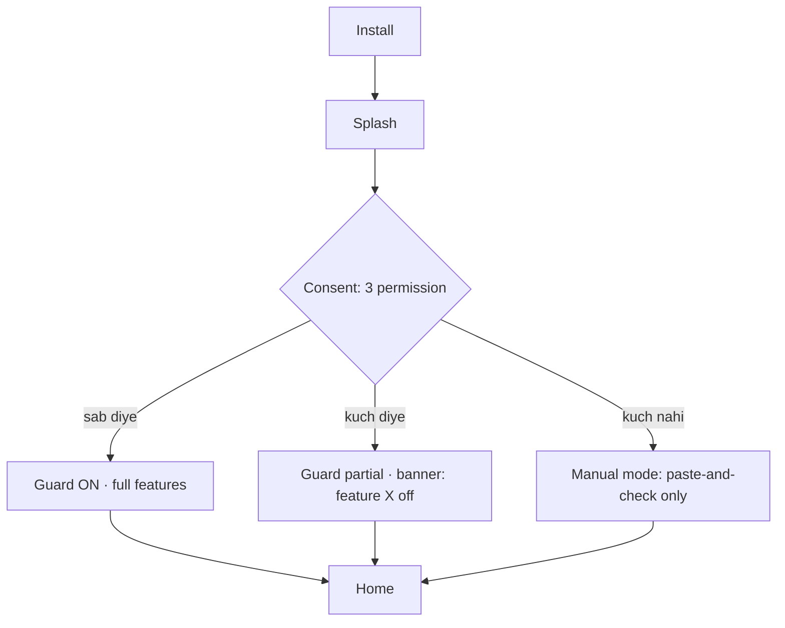
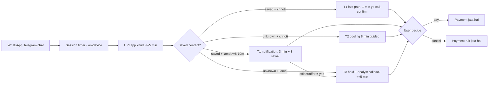
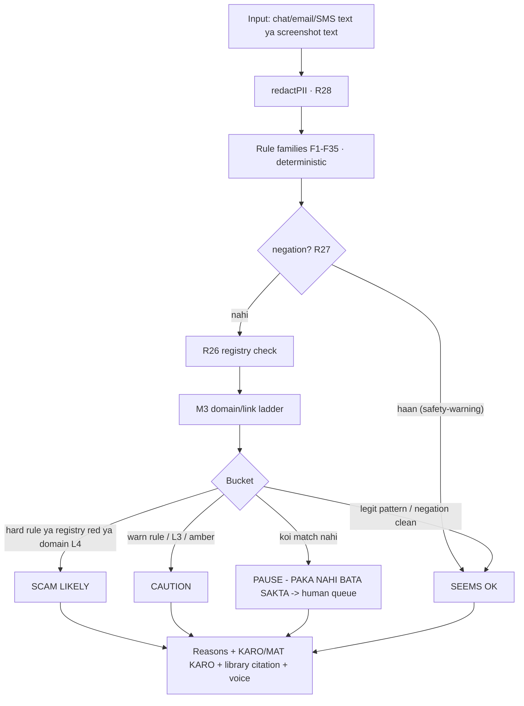
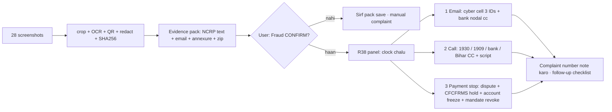
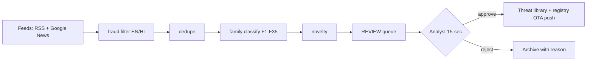

# SatarkPay · UI + Feature Spec (kaise kaam karega)

> **Ye file kya hai:** product ka poora, screen-by-screen blueprint — mobile app ka UI, analyst console, notifications, permissions, copy (Hinglish + Hindi voice), states (empty/loading/error), aur acceptance criteria. Isko padhke koi bhi banda (ya AI) demo ko real app me port kar sakta hai bina guess kiye.
> **Demo se rishta:** `web/satarkpay_m2.html` isi spec ka **clickable prototype** hai (offline chalta hai). Har screen ke neeche "demo me kahan" likha hai.
> **Rules ke ID:** R1–R14 = deck ka purana pack · R15–R25 = pack 1 (`rules/rules_R15_R25.json`) · R26–R38 = pack 2 (`rules/rules_R26_R38.json`).

---

## 0 · Conventions (chhota glossary)

| Term | Matlab |
|---|---|
| **T1 / T2 / T3** | Friction tiers — T1 = sirf check/nudge (0–1 min), T2 = cooling (8 min guided), T3 = hold + human analyst callback |
| **Guard ON** | SatarkPay protection chalu (user ne consent diya). Guard OFF me app kuch intercept nahi karti |
| **Gate** | Payment se pehle wala interruption (block nahi — sirf rukawat + options) |
| **Burst** | Bahut si payment-screenshots thode time me (30 min me 3+ / 5+) |
| **Payee** | Jisko paisa ja raha hai (UPI handle / account / merchant) |
| **Confirm** | User ka apna "haan, fraud hua" — app **kabhi** khud confirm nahi karti (R38 ka trigger) |
| **Evidence pack** | crop + redact + OCR + hash + complaint text ka bundle (R24/R25) |
| **Honest buckets** | `SCAM LIKELY` / `CAUTION` / `PAUSE-NAHI-BATA` / `SEEMS OK` — 4 alag buckets, fake confidence nahi |

**Core product principles (UI me dikhte hain):**

1. **Block kuch nahi** — payment rukta hai, user ke paas "Cancel" hamesha hota hai. (Deck ka core.)
2. **4 bucket verdict** — "pakka nahi bata sakta" ek *valid* jawab hai, failure nahi.
3. **Privacy pehle** — PII device par mask hoti hai (R28); screenshot ki image store nahi hoti, sirf entity + hash.
4. **Kaam ka jawab, theory nahi** — har verdict ke saath **KARO / MAT KARO** lines (2 sec me padhne layak).
5. **Bharat-first** — Hinglish copy, Hindi voice, senior mode, 2G-friendly (bina image load kiye kaam), offline fallback.

---

## 1 · Design system (2 min me)

### 1.1 Rung (palette)

| Token | Hex | Kahan |
|---|---|---|
| `bg` | `#0B1220` | poori app background |
| `panel` | `#121C31` | card / sheet |
| `ink` | `#E8EEF9` | main text |
| `dim` | `#9FB0CC` | helper text |
| `accent` | `#4CC9F0` | links, tags, focus ring |
| `ok` | `#3DDC97` | SEEMS OK, safe action |
| `warn` | `#FFC857` | CAUTION, cooling, deadlines |
| `danger` | `#FF6B6B` | SCAM LIKELY, emergency, red flags |

**Senior mode:** font size +25%, contrast AA→AAA (dim → `#C7D4EA`), tap target min 56px, icons ke saath label (icon-only nahi), animation slow.

### 1.2 Type scale

| Role | Normal | Senior |
|---|---|---|
| Screen title | 20/700 | 25/700 |
| Body | 15/400 | 19/400 |
| Helper | 12.5/400 | 16/400 |
| Big number (₹, clock) | 28/700 | 34/700 |
| Mono (txn, UTR, UPI ID) | 13/400 mono | 16/400 mono |

### 1.3 Components (reusable)

- **VerdictCard** — header chip (`SCAM LIKELY` / `CAUTION` / `SEEMS OK` / `PAUSE`), 3 reason bullets, `MAT KARO` line (red), `KARO` lines (green), source line ("Library T1–T24 se match · R26 registry · M3 link").
- **SigRow** — signal lappet: `label → value` + `tag` (ok/warn/bad).
- **ActionBar** — primary + secondary buttons; hamesha ek "Kuch mat karo / Cancel" option.
- **StepList** — checklist with tick + locked steps (order enforce ho to), e.g. R38 ke 3 steps.
- **Clock** — golden-hour / cooling countdown; colour: green <10 min, amber <30 min, red uske baad.
- **EvidenceStrip** — screenshot thumb (redacted) + txn/UTR + hash short.
- **EmptyState / Loading / Error** — teeno ka apna copy (neeche screens me likha hai).
- **VoiceBar** — top-right `🔊 voice: हिंदी ON/OFF`, jo bhi verdict aaya use padhta hai (Web Speech `hi-IN`).
- **SeniorToggle** — `👁 senior: ON/OFF`.
- **MaskToggle** — asli values ↔ masked (`7349••••••@ptaxis`).

### 1.4 Accessibility

- Colour kabhi akela signal nahi — har rung ke saath icon + label (`🔴 SCAM LIKELY`).
- TalkBack: VerdictCard ek hi continuous announcement; action buttons alag focusable.
- Voice output: verdict ke **pehle 240 characters** (taaki 2 sec me baat samajh aaye), full text screen par.
- Keyboard/switch: har button 1 tap se reachable; emergency flow me focus auto step-1 par.

---

## 2 · Navigation map

```
Splash/Consent (S0)
   └─ Home (S1) ─────────────┬─ M1 Check queue (S2)
                             ├─ Screenshot Radar (S3) ── Screenshot detail (S3b)
                             ├─ Domain/Link check (S4)
                             ├─ Sanchalak chat (S5)
                             ├─ Wallet audit (S6)
                             ├─ Intel feed (S7)
                             ├─ Report + Evidence pack (S8) ── Emergency (S9) ★R38
                             ├─ Grievance ladder (S10: SCORES / SMART ODR / NCRP follow-up)
                             └─ Settings + Consent centre (S11)
Analyst Console (separate web app, C1..C4)
```

Tab bar (bottom, 5 icons): **Home · Check · Sanchalak · Reports · Settings**. (Wallet/Intel/Domain home cards se khulte hain.)

---

## 3 · Screen-by-screen

Har screen me: **kaam · entry · wireframe · elements · states · copy · rules/data · failure mode · demo mapping · acceptance tests**.

### S0 · Splash + Consent centre (pehla launch)

**Kaam:** Guard ON karne se pehle saaf-saaf batao kaunsa signal kyun chahiye — aur kya nahi maang rahe.

```
┌───────────────────────────────┐
│  🛡 SatarkPay                  │
│  “Paisa bhejne se pehle 60     │
│   second — fraud ke baad 60    │
│   minute.”                     │
│                               │
│  SatarkPay ko chalane ke liye: │
│  ✅ Chat session ka time        │  ← UsageStats (sirf dwell)
│  ✅ Payment screenshot detect   │  ← Photos (naam/thumbnail parse)
│  ✅ Notification padhna (mandate│  ← NotificationListener
│     + OTP-warning alag karna)   │
│  ❌ SMS, contacts, gallery,     │  ← hum NAHI maangte
│     accessibility — NAHI       │
│                               │
│  [ Guard ON karo ]  [ Sirf     │
│                       manual ] │
│  Privacy note: analysis device │
│  par; raw chat/screenshot      │
│  server par nahi jaate (R28)   │
└───────────────────────────────┘
```

- **States:** pehla launch (consent), partial consent (guard degraded banner), revoked (grey icon + "Guard OFF").
- **Copy (voice line):** "आवाज़ चालू है। जो भी चेतावनी आएगी, मैं हिंदी में पढ़कर सुनाऊँगा।"
- **Data:** permissions ka status; **koi data upload nahi**.
- **Failure mode:** permission na di → M1/M2/M5 "manual-only" mode (user paste kare tab check hoga), banner: "Guard limited hai — 3 permission ke bina interception off".
- **Demo me:** top-right `Guard ON` chip + footer ka honest-limits line.
- **Acceptance:** teen permission *optional* hain, refuse karne par app crash na ho; consent screen par "kya nahi maangte" list dikhe.

### S1 · Home (dashboard)

**Kaam:** aaj ka risk snapshot + 3 sabse zyada kaam ki cheezein: pending check, naya intel, aur "paise gaye to kya karein" shortcut.

```
┌───────────────────────────────┐
│ 9:41   SatarkPay      🔊 👁 ⚙ │
│ ┌───────────────────────────┐ │
│ │ Aaj: 1 pending check      │ │ ← tap → S2
│ │ ⏱ 8:00 cooling chal raha  │ │
│ └───────────────────────────┘ │
│ [3 cards]                     │
│ 🔴 Is hafte ke naye scam: 12  │ → S7
│ 📸 3 payment screenshot      │ → S3
│ 🔗 2 link check kiye          │ → S4
│ ── quick actions ──           │
│ [Paste karke check karo] → S5 │
│ [Paisa gaya? Turant report] → │
│                            S8│
└───────────────────────────────┘
```

- **States:** naya user (empty: "Abhi kuch check nahi hua — pehla message paste karo"), active cooling (clock card sabse upar), fraud confirm ke baad (emergency strip).
- **Rules:** R21 (intel), R23 (matrix pending), R30 (first hour).
- **Demo me:** tab bar + M6 stats (784→172) home card me.

### S2 · M1 · Chat-Before-Pay check (the interception screen)

**Kaam:** jab user chat app se seedha UPI app me aata hai — yahi screen khulti hai (T1/T2/T3 ke hisaab se).

```
┌───────────────────────────────┐
│ ← Chat ke baad payment        │
│ Contact: ⚠️ SAVED (Ravi)  ya  │
│          ❓ UNKNOWN number     │
│ Chat session: 12 min 4 sec    │
│ (sirf foreground dwell)       │
│ ───── tier: T1 NOTIFICATION ──│
│ “Aapke saath 10+ minute chat  │
│  ke baad payment app khula    │
│  hai. Kya koi aapko paisa     │
│  bhejne ko keh raha hai?”     │
│ ── 3 sawal ──                 │
│ Q1 khud bhej rahe ho?   [Y/N] │
│ Q2 kisi officer/offer ne      │
│    kaha?                [Y/N] │
│ Q3 live call/chat chal        │
│    rahi hai?            [Y/N] │
│ [100% confirm — phir pay]     │
│ [Ruko 8 min · chat padho]     │
│ [Cancel payment]              │
└───────────────────────────────┘
```

- **Matrix (R15/R23):** SAVED+chhoti → T1 fast path (1 min / call-confirm) · SAVED+lambi (≥8–10 min) → T1 notification (3 min) · UNKNOWN+chhoti → T2 cooling 8 min guided · UNKNOWN+lambi → T3 hold + analyst callback · chat hi nahi → T1 nudge 0 min.
- **Anti-cheat:** timer foreground-dwell only; 5 s me wapas = credit nahi; "It's me" se notification nahi khulta (sawal ya trusted-person confirm chahiye); fast path per-payee 24h me ek baar.
- **States:** koi chat nahi (nudge only), app-left (clock pause), escalated (T3 me analyst card + ETA ≤5 min).
- **Copy (voice):** "रुकिए — जिस नंबर से बात हुई है वो सेव नहीं है। आठ मिनट में चैट दोबारा पढ़िए और तीन सवाल का जवाब दीजिए।"
- **Failure mode:** UsageStats band → screen "manual mode" me: user khud batae "kitni der chat ki thi" (dropdown) — phir wahi matrix chalti hai.
- **Demo me:** tab `01` (01a/01b/01c screenshots) + ops timeline `01d`.
- **Acceptance:** chaaron cells reproduce ho; koi cell auto-block na kare; T1 fast path me Cancel ke bina payment **nahi** hota.

### S3 · M2 · Screenshot Radar (+ detail S3b)

**Kaam:** payment-screenshot aane par source (app/domain) nikal kar warning; same payee ko baar-baar payment par staircase flag.

```
┌ S3 ────────────────────────────┐   ┌ S3b · Screenshot ─────────────┐
│ 📸 3 payment screenshots       │   │ [thumb — blur/redact]         │
│    (30 min)        ⚠️ amber    │   │ Source: qr-pay.top (L4 fake)  │
│ ── ── ── ── ── ── ── ── ──     │   │ UPI: 7349••••••@ptaxis        │
│ S3b · 9:38  shop-qr.top  🔴    │   │ Amount: ₹3,000                │
│ S3b · 9:31  qr-pay.top   🔴    │   │ Rule: R17 (provenance)        │
│ S3b · 9:27  amazonpay    🟢    │   │ [Ye screenshot analyse kiya]  │
│ ── payee staircase ──          │   │ [Image delete karo]           │
│ 7349••••••@ptaxis: 3 payments  │   └───────────────────────────────┘
│ 24h me — 3rd par cooling (R22) │
└───────────────────────────────┘
```

- **Rules:** R17 (provenance), R22 (repeat payment guard).
- **Data:** image **store nahi** hoti — sirf extracted entity + hash (7 din); thumbnail turant delete.
- **States:** 0 (empty: "koi payment screenshot nahi mila"), 1–2 (green/neutral), 3–4 (amber + R22 cooling), 5+ ya unverified source (red + hi-priority check).
- **Demo me:** tab `02` (burst + ops console "agla payment simulate karo").
- **Acceptance:** burst count, source-domain classify, 3rd/4th payment escalation (cooling → hold) demo me dikhe.

### S4 · M3 · Domain / Link trust

**Kaam:** link paste/scan par 4-level ladder + gateway-merchant mismatch.

```
┌───────────────────────────────┐
│ Link / domain: qr-pay.top     │
│  ● L4 · LOOKALIKE / FAKE      │
│  signals: homoglyph, risky TLD│
│  no-HTTPS? | IP-literal | @   │
│  brand-in-subdomain           │
│ ── gateway vs merchant ──     │
│ Gateway: Razorpay ✅ verified │
│ Merchant: quickearn-pro ⚠️    │
│  “gateway achha ≠ merchant    │
│   achha” — yehi 2026 trick    │
│ [Koi payment nahi] [Report]   │
└───────────────────────────────┘
```

- **Ladder:** L1 verified (RBI/NPCI/bank/PSP) · L2 verified merchant · L3 clean-unverified → amber · L4 fake → red.
- **Rules:** R18 + R26 (SEBI/NSDL registry + lookalike portal check).
- **Demo me:** tab `03` + `03b` (registry console).

### S5 · M4 · AI Sanchalak (chat check)

**Kaam:** koi bhi chat/email/SMS/screenshot ka text paste karo → verdict + reasons + kya karo.

```
┌───────────────────────────────┐
│ Sanchalak — “ye legit hai ya  │
│ nahi?”           🔊 speak      │
│ [chips: digital arrest · task │
│  offer · KYC/APK · refund trap│
│  SEBI fake reg · OTP warning] │
│ ┌───────────────────────────┐ │
│ │ (user paste)              │ │
│ │ 🔒 client-side redaction: │ │
│ │    2 item mask (R28)      │ │
│ └───────────────────────────┘ │
│ ┌ Sanchalak ────────────────┐ │
│ │ 🔴 SCAM LIKELY · F3       │ │
│ │ • deposit→payout pattern  │ │
│ │ • registered company nahi │ │
│ │ MAT KARO: deposit…        │ │
│ │ KARO: report 1930 · …     │ │
│ │ Library T1–T24 · R26 ✓    │ │
│ └───────────────────────────┘ │
│ [Poochho] [Human analyst]     │
└───────────────────────────────┘
```

- **Engine order (important):** redact (R28) → rules 1 → negation (R27) → registry (R26) → domain (M3) → verdict bucket → reasons + actions. LLM (production) sirf explanation likhta hai.
- **Buckets:** `SCAM LIKELY` (block-worthy) · `CAUTION` (aage badhne se pehle verify) · `PAUSE — PAKA NAHI BATA SAKTA` (naya variant → Intel Desk + human) · `SEEMS OK` (pattern legit-dikh raha hai, par verify suggest).
- **States:** empty ("kuch bhi paste karo — chat, SMS, email, ya screenshot ka text"), typing (spinner + "Sanchalak check kar raha hai…"), low-confidence (2 sawal + human button), human queued (case ID SP-XXXX).
- **Voice:** verdict ka pehla 240 chars Hindi me.
- **Demo me:** tab `04`, chips EX5 (fake SEBI reg → red flag) + EX6 (bank ka OTP warning → SEEMS OK), aur **eval card** (33 messages, live P/R/F).
- **Acceptance:** fake SEBI number par red flag; bank ke apne OTP-warning par SEEMS OK; negation ke dono order handle; redaction count dikhe.

### S6 · M5 · Wallet / AutoPay / Link audit

**Kaam:** kaunse apps linked hain, kaunse mandate lage hain, kaunsa mandate "one-time" batakar recurring hai.

```
┌───────────────────────────────┐
│ Linked: PhonePe GPay Paytm …  │
│         (6 apps, 4 accounts)  │
│ Mandates:                     │
│ 🔴 Daily ₹299 · quick-earn    │ ← “one-time” bola gaya tha
│      next debit: kal 6 am     │
│ 🔴 New Mandate · unverified   │
│ 🟠 Weekly ₹99 · gaming        │
│ 🟢 LIC ₹1,847 · 1 Nov         │
│ ── delegates ──               │
│ ⚠️ 2 UPI-Circle delegates     │
│ [Revoke] [Poora audit bhejo]  │
└───────────────────────────────┘
```

- **Rules:** R20 (mandate signals) + R22 (frequency).
- **Acceptance:** daily/“one-time-claimed” mandate red; revoke ek tap me (demo me list se item hat jaye).

### S7 · M6 · Intel feed (live scam patterns)

**Kaam:** crawler ke naye patterns + analyst-approved threat-library updates.

```
┌───────────────────────────────┐
│ Aaj: 784 raw → 172 relevant → │
│      63 novel (REVIEW queue)  │
│ [All][WhatsApp][Telegram][UPI]│
│ • parcel/CBI video-call fraud │
│   family F1 · WhatsApp · new  │
│ • Telegram task scam          │
│   family F3 · Telegram · 2d   │
│ ── review queue (analyst) ──  │
│ [Approve → push OTA]          │
└───────────────────────────────┘
```

- **Rule R21:** auto-publish **nahi** — analyst 15-second verdict ke baad hi registry push.
- **Demo me:** tab `06`.

### S8 · M7 · Report + Evidence pack

**Kaam:** fraud ke baad 4 minute ka kaam 8 second me — pack banao jo 1930/NCRP/cyber-cell/bank ko jaata hai.

```
┌───────────────────────────────┐
│ 28 screenshots mile            │
│ ₹5,000 evidence-visible        │
│ UPI 7349••••••@ptaxis (masked) │
│ Txn/UTR 2 · shortlink cutt.ly/ │
│ Maanga gaya ₹30,625 (3 demand) │
│ [📦 Pack banao] [👁 mask]      │
│ ── pack me kya banega ──       │
│ complaint_ncrp.md (HI+EN)      │
│ complaint_email.eml · annexure │
│ evidence_bundle.zip · hashes   │
│ [🚨 FRAUD CONFIRM → S9]        │
└───────────────────────────────┘
```

- **Pipeline (R24/R25):** ingest → smart crop (status bar/nav hata) → OCR offline → entity extract (UPI, txn, UTR, link, ₹) → QR decode → redact (2 copies: full+masked) → SHA-256 per file → NCRP text + email + annexure CSV + ZIP.
- **Privacy:** masked copy default (kyunki log WhatsApp par share karte hain); originals **modify nahi** hote (hash verify ke liye).
- **Demo me:** tab `07`.

### S9 · 🚨 Emergency (R38) — fraud CONFIRM ke baad 3 kadam

**Kaam (user ka exact ask):** "agar lagta hai fraud ho gaya, aur confirm hai — to turant cyber cell ko complaint mail, aur payment stop karne ke liye helpline se direct baat."

```
┌───────────────────────────────┐
│ 🚨 FRAUD CONFIRM · clock +00:42│
│ steps 1/3 · pack: bhej diya    │
│ ── 1 · 📧 Email ───────────────│
│ To: patnacyberpps-bih@gov.in,  │
│     sp-cyber@biharpolice.gov.in│
│     cciu-bih@nic.in            │
│ Cc: bank nodal officer         │
│ Sub: UPI fraud ₹5,000 · 2 txn  │
│ [Mail bhejo] [Draft copy]      │
│ ── 2 · 📞 Call ────────────────│
│ [1930] [1909] [Bank] [Bihar CC]│
│ script: naam · txn/UTR · ₹ ·   │
│ “freeze request + complaint no”│
│ ── 3 · ⛔ Payment stop ────────│
│ dispute/chargeback + beneficiary│
│ hold (CFCFRMS) + account freeze│
│ + unknown mandate revoke       │
│ [Stop-request banao] [Copy]    │
│ ── 4 (optional) 👨‍👩‍👧 Parivaar  │
│ alert (masked numbers)         │
└───────────────────────────────┘
```

- **Rule R38 + R30.** Clock us waqt chalta hai jab user confirm karta hai (colour green <10 min).
- **Auto-send NAHI:** app draft + dialer + script deti hai; bhejna/call user ke tap par (privacy).
- **States:** step pending (grey) → done (green tick) → 3/3 par "complaint number sambhalo" note.
- **Copy (voice):** "तुरंत 1930 पर कॉल कीजिए। ट्रांज़ैक्शन आईडी, यूटीआर और रकम सामने रखिए। फ़्रीज़ रिक्वेस्ट इसी कॉल पर जाती है।"
- **Demo me:** tab `07` → `🚨 Fraud CONFIRM` → panel (screenshot `11_emergency_confirm_action.png`).
- **Acceptance:** 3 step tick ho, email me txn/UTR + annexure mention ho, call script dikhe, stop-request me CFCFRMS + mandate revoke ho, optional step 4 skip ho sake.

### S10 · Grievance ladder (investment angle)

**Kaam:** agar scam me broker/registered intermediary involve hai — ladder follow karo.

```
Broker → Exchange → SEBI SCORES (scores.gov.in) → SMART ODR (smartodr.in)
```

- **Rule:** R30 + escalation ladder; har step par document checklist + follow-up date.
- **Copy:** "Complaint number likh lo — 30 din me nahi suna to next step."
- **Demo me:** M7 card ki SCORES/SMART ODR rows.

### S11 · Settings + Consent centre

| Section | Items |
|---|---|
| Language | 12 languages (dropdown) + voice on/off + voice language |
| Accessibility | senior mode, high contrast, font scale, screen-reader announcements |
| Privacy | PII redaction on/off (default ON), OCR opt-in, screenshot retention (default 0), evidence folder location, "mera data delete karo" |
| Guard | Guard ON/OFF, per-payee fast path reset, trusted persons list |
| Emergency defaults | city, bank, cyber-cell email presets (Bihar default, editable) |
| About | honest limits, license (MIT), credits (`NOTICE.md`), demo script |

---

## 4 · Core flows (mermaid)

### 4.1 Launch + consent



### 4.2 M1 gate (payment se pehle)



### 4.3 M4 verdict engine



### 4.4 Fraud ke baad: evidence → confirm → action (R38)



### 4.5 M6 intel publish (analyst gated)



---

## 5 · Analyst console (web, C1–C4)

| Screen | Kaam | Key elements |
|---|---|---|
| **C1 Queue** | escalated + low-confidence cases | case list (risk, family, age), SLA timer (≤5 min), "attach rule R1" |
| **C2 Case detail** | chat/screenshot (redacted), signals, verdict draft | verdict override (reason code), notes, user-callback button |
| **C3 Review queue** | M6 crawled items | 15-sec approve/reject, family tag, novelty score |
| **C4 Registry** | approved patterns → app OTA | rule JSON diff, version, rollback |

- **Demo me:** M4 ka "Sanchalak queue" card (escalated + low-confidence), M6 ka review queue + approve button.

---

## 6 · Notification + copy bank (voice-ready)

| Trigger | Hinglish (screen) | Hindi (voice) |
|---|---|---|
| M1 long chat | "Aapke saath 10+ minute chat ke baad payment app khula hai. Kya koi aapko paisa bhejne ko keh raha hai?" | "दस मिनट से ज़्यादा बात के बाद आप भुगतान ऐप में आए हैं। क्या कोई आपसे पैसे भेजने को कह रहा है?" |
| M1 unknown short | "Unknown number se baat ke turant baad payment. 8 minute me chat dobara padho aur 3 sawal." | "यह नंबर सेव नहीं है। आठ मिनट रुकिए, चैट दोबारा पढ़िए।" |
| M2 burst | "30 minute me 3 payment screenshot — ruk jao, ye scam pattern hai." | "तीस स्क्रीनशॉट मिले हैं। रुकिए, यह धोखे का पैटर्न है।" |
| M3 L4 | "Ye website fake lag rahi hai. Koi payment ya detail mat bhejo." | "यह वेबसाइट नकली लग रही है। कोई भुगतान न करें।" |
| M4 SCAM | "Ye scam hai (family F3). Deposit mat karo — 1930 par report karo." | "यह धोखा है। पैसा न भेजें। एक नौ तीन शून्य पर रिपोर्ट करें।" |
| M4 PAUSE | "Pakka nahi bata sakta. Do sawal: paisa bhejna hai ya aana hai? Kisi ne kaha hai?" | "मैं पक्का नहीं बता सकता। दो सवाल पूछता हूँ।" |
| R38 email | "Cyber cell + bank ko email draft ready hai — bhej do." | "साइबर सेल को ईमेल तैयार है। भेज दीजिए।" |
| R38 call | "1930 par call karo. Txn ID, UTR aur रकम सामने रखो." | "एक नौ तीन शून्य पर कॉल कीजिए। ट्रांज़ैक्शन आईडी और यूटीआर सामने रखिए।" |
| R38 stop | "Payment stop request ban gayi — bank ko bhej do." | "भुगतान रोकने का अनुरोध तैयार है।" |

**Expansion plan (12 languages):** Hinglish master se translate → native review (Bhojpuri, Maithili, Bengali, Marathi, Tamil, Telugu, Kannada, Malayalam, Gujarati, Odia, Punjabi) → voice ke liye Bhashini/Web Speech.

---

## 7 · Permissions & data matrix (judges ke liye)

| Feature | Signal | Kyun chahiye | Kahan rehta hai | Bina permission |
|---|---|---|---|---|
| M1 | `UsageStatsManager` app-switch + foreground dwell | chat→UPI ka pattern | device par (7 din) | manual "kitni der chat ki" dropdown |
| M2 | Photos/MediaStore observer + source app | screenshot ka source | device; image delete, sirf entity+hash | manual screenshot paste |
| M5 | `NotificationListenerService` (bank/mandate notifications) | AutoPay mandate detect | device par | user khud mandate list type kare |
| M7 | Files/OCR (opt-in) | evidence pack | device; user-driven share | manual upload |
| — | SMS, Contacts, Accessibility, `QUERY_ALL_PACKAGES` | — | — | **hum maangte hi nahi** (deck me likha) |

---

## 8 · Non-goals + guardrails in UI (kya kabhi nahi dikhega)

- ❌ Koi buy/sell/hold tip, price target, "guaranteed return", ya paid group ka naam (R36 ka UI kehta hai "tip ka tareeka risk hai", market view nahi).
- ❌ Koi auto-block ya auto-debit stop bina user ke.
- ❌ Koi fraud *claim* app ki taraf se — "confirm" hamesha user ka.
- ❌ Koi certificate-jaisa "SEBI registered ✅" badge — hum **format/domain/list** check karte hain aur sebi.gov.in par bhejte hain.
- ❌ Koi hidden data upload: demo/offline mode me network call zero; production me bhi raw text device par.
- ❌ Koi dark pattern: Countdown "sirf dekho" ke liye hai, daraane ke liye nahi; Cancel hamesha barabar ka button hai.

---

## 9 · Demo ↔ spec mapping

| Screen | Demo tab / element | Screenshot |
|---|---|---|
| S0, S11 | header chips (`Guard ON`, `🔊 voice`, `👁 senior`) | 10 |
| S1 | tab bar + M6 stat cards | — |
| S2 | tab `01` | 01a/01b/01c/01d |
| S3 | tab `02` | 02 |
| S4 | tab `03` (+ `03b` registry) | 03, 03b |
| S5 | tab `04` + eval card | 04, 08, 09 |
| S6 | tab `05` | 05 |
| S7 | tab `06` | 06 |
| S8 | tab `07` | 07 |
| S9 | tab `07` → 🚨 Fraud CONFIRM | 11 |
| S10 | tab `07` ke channel rows | 07 |
| C1–C4 | M4 queue card + M6 review queue | 04, 06 |

---

## 10 · Acceptance checklist (finale se pehle)

- [ ] S0 ke teen permission refuse karne par app manual mode me chale (crash na ho)
- [ ] M1 ke chaaron cell reproduce ho + koi auto-block na ho + Cancel hamesha dikhe
- [ ] M2: 3rd/4th payment par cooling → hold; image store na ho
- [ ] M3: L1–L4 + gateway≠merchant warning
- [ ] M4: fake SEBI number par red flag; OTP-warning par SEEMS OK; negation dono order; redaction count
- [ ] M5: daily/“one-time” mandate red + revoke
- [ ] M6: analyst approve ke bina kuch publish na ho
- [ ] M7: hashes + annexure + masked default
- [ ] R38: 3 step tick + email me txn/UTR + call script + CFCFRMS stop-request + optional step skip
- [ ] Senior mode + Hindi voice har verdict par kaam kare
- [ ] Offline: network off karke poora demo chale (koi CDN/API nahi)
- [ ] Har verdict par KARO/MAT KARO + library citation ho
